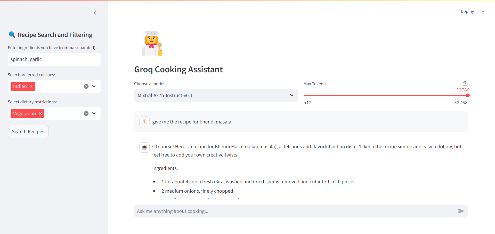

# Chef's Palette🍳👨‍🍳

Welcome to the Chef's Palette🍳👨‍🍳, your go-to helper for all things related to cooking! This chatbot is designed to make your cooking experience smoother, faster, and more enjoyable by providing you with helpful guidance in the kitchen, whether you're a beginner or a seasoned chef.

With this chatbot, you can ask for recipes, get ingredient substitutions, learn cooking techniques, or even plan a meal from scratch. It's like having a personal assistant chef right at your fingertips!

## Features

- *Model Selection*: Users can select between mixtral-8x7b-32768, llama2-70b-4096, Gemma-7b-it, llama2-70b-4096, llama3-70b-8192, and lama3-8b-8192 models to tailor the conversation according to each model's capabilities.
- *Dynamic Response Generation*: Utilizes a generator function to stream responses from the Groq API, providing a seamless chat experience.
- *Error Handling*: Implements try-except blocks to handle potential errors gracefully during API calls.
- *Recipe Searching and Filtering*: Utilizes Spoonacular API for recipes and ingredients for fast and seamless searching of recipes.

## Requirements

- Streamlit
- Spoonacular
- Groq Python SDK
- Python 3.7+

## Setup and Installation

- *Clone the Repository*:

  bash
  git clone https://github.com/Adityaapandkar/Chefs-Palette
  

- *Install Dependencies*:

  bash
  pip install -r requirements.txt
  

- *Set Up Groq API Key and Spoonacular API Key*:

  Ensure you have an API key from Groq. This key should be stored securely using Streamlit's secrets management:

  toml
  # .streamlit/secrets.toml
  GROQ_API_KEY="your_api_key_here"
  SPOONACULAR_API_KEY = "your_api_key_here"
  

- *Run the App*:
  Navigate to the app's directory and run:

bash
streamlit run app.py

## Usage

Upon launching the app, you are greeted with a title and a model selection dropdown.

After choosing a preferred model, you can interact with the chat interface by entering prompts.

The app displays the user's questions and the AI's responses, facilitating a back-and-forth conversation.

## Customization

The app can be easily customized to include additional language models (as Groq adds more), alter the user interface, or extend the functionality to incorporate other interactions with the Groq API.

## Contributing

Contributions are welcome to enhance the app, fix bugs, or improve documentation.

Please feel free to fork the repository, make changes, and submit a pull request.
